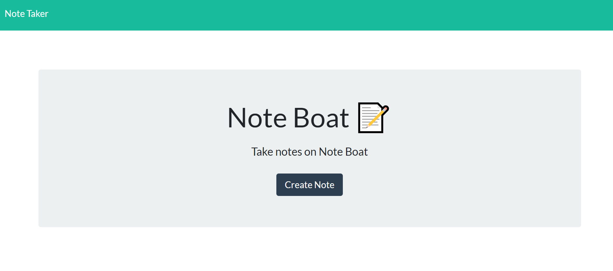
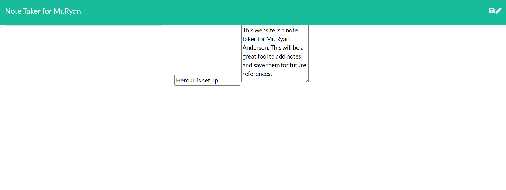

## Note_Taker App on Heroku

Ryan's Note Taker!
You can see live @
https://temp-ryans-note-taker.herokuapp.com/

## Description

This is a creative and interactive note taker that can help make your day more productive. You can create a note title to go along with your note!

## License

## Installation

What are the steps required to install your project? Provide a step-by-step description of how to get the development environment running.
-Go to the live site attached above to start!

## Images

## Credits

Created by Ryan Anderson

Any questions? I find this assignment very interesting and was fun interacting with heroku!

What is your GitHub username? @ryansswell

What is your email? ryan0425@msn.com
